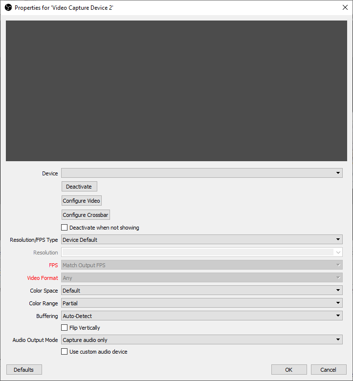

# OBS Sources

## Audio Input/Output Capture

อินพุตนี้ช่วยให้คุณสามารถเพิ่มสัญญาณเสียงหรือเข้าหรือออก (เช่นไมโครโฟนหรือชุดหูฟัง) ไปยังฉาก (scence) ที่ต้องการ 
ไม่ว่าจะเชื่อมต่ออินพุตจากแหล่งมีเสียงเพียงอย่างเดียว หรือมีทั้งภาพและเสียงก็ตาม OBS จะแยกสัญญาณเสียงออกมาและแสดงใน Mixer control
การระบุแหล่งอินพุตแลลสัญญาณเสียง จะช่วยให้เราสามารถเลือกใช้งานเสียงเฉพาะในฉากที่ต้องการ

### คำเตือน:

การใช้งานแหล่งอินพุตนี้ อาจจะทำให้เกิดเสียงก้องหรือสัญญาณหวีดได้ เช่นเดียวกับการใช้เครื่องเสียงกลางแจ้ง โดยเฉพาะหากคีอุปกรณ์เดียวกันที่เลือกไว้ในการ Settings -> Audio ดังนั้น ถ้าหากวางแผนที่จะเพิ่มอุปกรณ์เสียงลงในฉากใดๆ โดยตรง ให้ทำการตรวจสอบให้แน่ใจว่าอินพุตเสียงถูกปิดการใช้งานที่อื่นๆ เสียก่อน

### Blackmagic Device
อุปกรณ์ Blackmagic คืออุปกรณ์สำหรับ Capture สัญญาณวิดีโอลงคอมพิวเตอร์ โดยทั่วไปจะ รองรับช่องสัญาณ Input  ทั้ง SDI และ HDMI ใช้งานได้ทั้งระบบ SD และ HD เหมาะสำหรับงาน Ingest เพื่อตัดต่อวิดีโอ หรือนำสัญญาณจากกล้องเข้าคอมพิวเตอร์เพื่อไปทำ Streaming

Blackmagic ใช้ได้กับโปรมแกรมหลากหลาย เช่น Wirecast , DaVinci Resole , Fusion , Final Cut Pro X , Premiere Pro , Avid , After Effects , Photoshop

[รายละเอียดตัวอย่างอุปกรณ์ Blackmagic](https://www.airbondstore.com/th/converter/297-blackmagic-ultrastudio-mini-recorder)

### ตัวเลือกอุปกรณ์สำหรับอุปกรณ์ Blackmagic  

รายการ | รายละเอียด
--|--
Device | รายการดรอปดาวน์ที่ให้เลือกอุปกรณ์ Blackmage ที่ต้องการใช้
Mode | ตั้งค่าโหมดวิดีโอของอุปกรณ์ ควรตั้งค่่าให้ตรงกับความละเอียดของเอาต์พุต (เช่นกล้องหรือคอนโซลเกม) สื่อของคุณและเฟรม
Format| เลือกรูปแบบวิดีโอที่อุปกรณ์ใช้งานซึ่งควรตรงกับผลลัพธ์ของสื่อที่ต้องการบันทึก
Use Buffering (Checkbox) | เปิดใช้งานหรือปิดการใช้งานการบัฟเฟอร์ภาพและเสียงสำหรับอุปกรณ์ Blackmagic สิ่งนี้สามารถช่วยแก้ไขปัญหาเกี่ยวกับระบบที่มีทรัพยากรเหลือน้อยหรืออุปกรณ์ที่มีไดรเวอร์ไม่ดีหรือปัญหาด้านอื่นๆ ที่เกี่ยวกับฮาร์ดแวร์

ถ้าไม่มีอุปกรณ์ Blackmagic ติดตั้งอยู่ในระบบ ก็จะมองไม่เห็นตัวเลือกนี้

## BrowserSource
แหล่งเบราว์เซอร์เป็นหนึ่งในแหล่งอินพุตที่หลากหลายที่สุดอย่างหนึ่งใน OBS  

### ตัวเลือกต่างๆ ของ อินพุตแบบเบราว์เซอร์

รายการ | รายละเอียด
--|--
Local File (Checkbox) |บอกแหล่งที่มาหากคุณกำลังโหลดหน้าเว็บจากเครื่องคอมพิวเตอร์ที่กำลังใช้งานอยู่หรือจากเครื่องอืนๆ (จากอินเตอร์เน็ต)
Width| ตั้งค่าความกว้างวิวพอร์ตของหน้าเบราว์เซอร์
Height| ตั้งค่าความสูงวิวพอร์ตของหน้าเบราว์เซอร์
FPS| ตั้งค่า FPS สำหรับเบราว์เซอร์
CSS| โดยปกติ ค่าเริ่มต้นจะเป็นดังนี้   ตั้งค่าพื้นหลังให้โปร่งใส   ลบระยะขอบบนเนื้อหา   ซ่อนแถบเลื่อน (ในกรณีที่หน้าเว็บแสดงผลใหญ่กว่าความกว้าง / ความสูงวิวพอร์ต)
Default CSS | body { background-color: rgba(0, 0, 0, 0); margin: 0px auto; overflow: hidden; }
Shutdown source when not visible (Checkbox) | เลิกโหลดหน้าเมื่อไม่เห็นแหล่งที่มาอีกต่อไป (โดยคลิกที่ไอคอนรูปตาเพื่อซ่อนหรือไม่อยู่ในฉากที่ใช้งานอยู่)
Refresh browser source when scene becomes active (Checkbox) |  รีเฟรชหน้าเมื่อเปิดใช้งาน (เมื่อเปลี่ยนมาเป็นฉากที่มีอินพุตแบบบราวเซอร์)
Refresh cache of current page (Button) |  รีเฟรชหน้าและเนื้อหาทั้งหมด 

### ข้อควรระวังในการใช้งานอินพุตแบบ Browser
สำหรับเวบไซต์ที่มีการล็อกอิน บางครั้งอาจจะพบว่าหน้า Browser ไปค้างที่หน้าล็อกอิน เนื่องจาก OBS ไม่ได้ใช้ session เดียวกับ browser ตัวอื่นๆ   
ถ้าเจอกรณีนี้ อาจจะเลี่ยงไปใช้งานอินพุตอชนิดอื่นแทน 

## Color Source
แหล่งอินพุตนี้สร้างสีทึบเพื่อเพิ่มเข้าไปในฉาก  ซึ่งสามารถใช้สำหรับสิ่งต่าง ๆ เช่นสีพื้นหลังหรือ alpha channel

### ตัวเลือกต่างๆ ของ Color Source

รายการ | รายละเอียด
--|--
Color|  เลือกสีที่ต้องการ รวมถึงค่า alpha 
Width/Height| ตั้งค่า  resolution ของ source    ควรตั้งค่าความกว้างและความสูงให้สอดคล้องกับหน้าจอหลักของวิดีโอที่ต้องการผลิต  

##  Display Capture
Display Capture ใช้เพื่อจัพภาพทั้งหน้าจอ มีตัวเลือกให้เลือกเพียงสองตัวคือ drop down สำหรับเลือกหน้าจอทีต้องการจับภาพและ check box ที่ให้เลือกว่าจะแสดง cursor หรือไม่ 
ในการจับภาพหน้าจอ จะสามารถเพิ่มอินพุตได้หนึ่งหน้าจอต่อหนึ่งอินพุตเท่านั้น ถ้าต้องการใช้ในฉากอื่นๆ ให้เลือกที่ add existing

 

 Display Capture นี้จะสามารถเพิ่มได้เพียงครั้งเดียวต่อหนึ่งหน้าจอเท่านั้น ถ้าหากต้องการใช้ในฉากอื่นๆ ให้เลือก Add Existing!

##  Game Capture

Game Capture เป็น input source ที่ช่วยให้สามารถจับภาพเกมที่เล่นได้โดยตรง โดยเกมนั้นจะต้องเป็น DirectX หรือ OpenGL Game Capture    
Game Capture เป็นวิธีที่มีประสิทธิภาพที่สุดในการเพิ่มหน้าจอของเกมไปยัง OBS  มีเกมจำนวนน้อยมากที่ไม่สามารถใช้กับ Game Capture ได้   

เมื่อเพิ่ม Game Capture Source แล้ว จะต้องเลือกตัวเลือกที่เหมาะสมกับการจับภาพเกมจาก drop down 

 ### Mode 
 <li>Capture any fullscreen application 

 ตัวเลือกนี้ จะจับภาพเต็มหน้าจอและจะค้นหาเกมที่กำลังรันอยู่บนหน้าจอหลักโดยอัตโนมัติ และเพิ่มแอพพลิเคชั่นนั้นไปยัง Game Capture source ใน OBS ดังนั้น ควรเลือกตัวเลือกนี้เมื่อเล่นเกมแบบเต็มหน้าจอ 

ถ้าเครื่องคอมพิวเตอร์มีเพียงหน้าจอเดียว เราจะไม่สามารถเห็นการทำงานของ OBS ในขณะที่เล่นเกม ถ้าทำการกด Alt+Tab เพื่อสลับจากหน้าจอเกมส์มายัง OBS จะพบว่าเกมส์จะหยุด render โดยอัตโนมัติ
 
 
 <li>Capture specific window

ตัวเลือกที่สองนี้มีไว้สำหรับการจับภาพเกมส์บนวินโดวส์ที่กำหนด ช่วยให้สามารถเลือกหน้าต่างเกมส์ที่จะจับภาพได้อย่างสะดวก อย่างไรก็ตาม ถ้ารันเกมส์พร้อมๆ กันสองหน้าต่าง จะต้องเลือก Window Match Priority ให้ตรงกับวินโดวส์ที่ต้องการ

 
 <li>Capture foreground window with hotkey
 
ตัวเลือกสุดท้ายจับหน้าต่างพื้นหน้าด้วยปุ่มลัด ช่วยให้สามารถตั้งค่าคีย์ลัดขึ้นมาใช้ เพื่อเลือกอินพุตของของ Game Capture ที่จะให้แสดงในฉาก
 มีประโยชน์ในกรณีที่ต้องการเปลี่ยนเกมบ่อยครั้งในระหว่างการสตรีมและไม่ต้องการกลับไปเลือกตัวเลือกในการจับภาพเกมทุกครั้งเพื่อเลือกเกมใหม
 ปุ่มลัดสามารถตั้งค่าได้ที่ Settings -> Hotkeys หลังจากที่ได้เพิ่มแหล่งจับภาพจากเกมถูกเพิ่มเข้าไปในฉากแล้ว 

นอกจากนี้ยังมีตัวเลือกอื่นๆ อีก ซึ่งโดยทั่วไปจะใช้ตามที่โปรแกรมกำหนดมาให้ ยกเว้นว่าจะกำหนดอะไรที่พิเศษจริงๆ 

รายการ | รายละเอียด
--|--
Multi-adapter Compatibility | ใช้สำหรับระบบที่มี GPU หลายตัว (เช่นแล็ปท็อป)   ตัวเลือกนี้จะเปลี่ยนวิธีการจับภาพจากการจับภาพพื้นผิวที่ใช้ร่วมกันเป็นการจับภาพหน่วยความจำ การจับหน่วยความจำมีประสิทธิภาพน้อยกว่าการจับภาพแบบ shared texture   capture เป็นการจับภาพแบบ memory capture   Memory capture จะมีประสิทธิภาพด้อยกว่า shared texture capture และควรเลือกใช้ตัวเลือกนี้เฉพาะกรณีที่ไม่มีทางเลือกจริง
Force Scaling | อนุญาตให้กำหนดสเกลบนแหล่งจับภาพด้วยตนเอง
Limit capture framerate | จำกัดอัตราเฟรมของ Game Capture source ไม่ให้สูงเกินที่ OBS กำหนด
Capture Cursor | แสดงหรือซ่อนเคอร์เซอร์ของเมาส์ในเกม (หท่ยถึง cursor ของวินโดวส์ ที่ปรากฏอยู่บนหน้าจอเกมส์ ไม่รวมถึง mouse cursors ที่แสดงในเกมส์ ซึ่งจะถูกแสดงเสมอ) 
Use anti-cheat compatibility hook  |  ช่วยป้องกันไม่ให้เกมส์มองว่า OBS เป็น cheat  (cheat : ซอฟต์แวร์ที่ติดตั้งเพื่อโกงในการเล่นเกมส์ เช่น เพิ่มเงินหรือเวลาอย่างไม่จำกัด  )
Capture third-party overlays (such as steam)| ถ้าเกมส์ที่จับภาพ ไม่มี  overlay ที่ขัดแย้งกับความสามารถของ Game Capture ก็จะถูกจับภาพมาใส่ในฉากได้

##  Image

Image Source ช่วยให้สามารถใส่ภาพประเภทต่างๆ ให้กับฉากที่ต้องการ  
รองรับรูปแบบภาพส่วนใหญ่ การสนับสนุนแชนเนลอัลฟ่าก็มีให้ใช้ตามความเหมาะสม  
ตัวเลือกมีแค่ 2 ตัวคือ 
1. เส้นทางไปยังรูปภาพ
2. ยกเลิกการโหลดรูปภาพเมื่อฉากไม่ถูกแสดง 

ช่องทำเครื่องหมายนี้จะยกเลิกการโหลดภาพจากหน่วยความจำในขณะที่ไม่ได้ใช้งาน ซึ่งจะมีประโยชน์ในกรณีที่มีภาพจำนวนมากและมีข้อจำกัดด้านทรัพยากรของระบบ เช่นหน่วยความจำหรือความเร็วซีพียู

รูปแบบภาพที่รองรับของ Image Source คือ  .bmp, .tga, .png, .jpeg, .jpg และ. gif

##  Image Slide Show

อินพุตแบบ Image Slide Show ช่วยให้สามารถเพิ่มรูปภาพหลาย ๆ รูปแบบที่จะเลื่อนโดยอัตโนมัติ วิธีการเพิ่มคือให้คลิกเครื่องหมาย + เพื่อเพิ่มไฟล์หรือไดเรกทอรีที่จะโหลด
เมื่อเพิ่มภาพทั้งหมดที่ต้องการเข้าไปแล้ว ก็สามารถกำหนดรูปแบบที่จะแสดงได้

รายการ | รายละเอียด
--|--
Transition | เป็น drop down box ที่สามารถเลือก effect ที่เกิดขึ้นขณะเปลี่ยนภาพ โดย effect ที่มีให้ใช้ประกอบด้วย fade (จาง) cut (ตัดภาพ), slide (เลื่อน), หรือ  swipe (กวาด)
Time Between Slides (milliseconds) | กำหนดเวลาที่จะเสองแต่ละภาพ (รวมทั้งเวลาของ effect ในการเปลี่ยนภาพจนครบอย่างสมบูรณ์)
Transition Speed (milliseconds) | เป็นเวลาของ effect ที่เกิดขึ้นขณะเปลี่ยนจากภาพหนึ่งไปอีกภาพหนึ่ง  ค่านี้จะไม่ทำให้เวลาในการแสดงภาพเพิ่มขึ้น เช่น ถ้าตั้งเวลาของแต่ละภาพไว้ที่ 10000 มิลลิวินาที และตั้งเวลา transition ไว้ที่ 2000 มิลลิวินาที การเปลี่ยนภาพก็จะเริ่มต้นที่ 8000 มิลลิวินาที   ถ้าเวลานี้มากกว่าเวลาในการเปลี่ยน slide ก็จะถูกลดลงให้มีค่าที่เหมาะสม อย่างไรก็ตาม เวลานี้ต้องไม่สั้นกว่า 50 มิลลิวินาที
Randomize Playback (checkbox) | เลือกว่าจะเล่นภาพแบบสุ่มหรือเล่นไปตามลำดับที่ได้เพิ่มไฟล์เอาไว้ตั้งแต่ต้น
Image file type  | .bmp  .tga .png .jpeg .jpg .gif

##  Intel® RealSense™ 3D Camera GreenScreen

เป็นอินพุตซึ่งเชื่อมต่อกับ digital green screen ของ Intel RealSense camera. RealSense cameras เป็นการรวมกล้องธรรมดาเช้ากับ infrared lasers และ  infrared camera เพื่อสร้างภาพจำลองของสิ่งที่อยู่หน้าจอและส่วนของวิดีโอที่สามารถตัดออกการซ้อนภาพบน  green screen ในอินพุตชนิดนี้ไม่มีตัวเลือกให้เลือก การตั้งค่าต่างๆ ถูกกำหนดนอกโปรแกรม OBS

[ดูเพิ่มเติมได้จากวิดีโอบน Youtube](https://www.youtube.com/watch?v=KMxXOcBsFZQ)

##  Media Source

Media source ใช้เพิ่ม media ชนิดต่างๆ เข้ามาใน OBS ดังรายละเอียดในตาราง 

รายการ | รายละเอียด
--|--
Video | .mp4, .ts, .mov, .flv, .mkv, .avi, .gif, .webm
Audio | .mp3, .aac, .ogg, .wav

ตัวเลือก  "Local file" จะช่วยให้สามารถเลือกว่าจะใช้ media ในเครื่องหรือจาก URL ที่ต้องการ ถ้าเลือกจาก URL ก็อาจจะไม่ต้องระบุในช่อง Input Format 

เมื่อเลือก media ที่ต้องการแล้ว เราก็สามารถกำหนดตัวเลือกได้ดังต่อไปนี้

รายการ | รายละเอียด
--|--
Loop | ตั้งค่าการเล่นซ้ำของ media 
Restart playback when source becomes active | กำหนดให้ media เล่นตั้งแต่เริ่มทุกครั้งที่เลือกฉาก 
Use hardware decoding when available | ใช้การถอดรหัสด้วยฮาร์ดแวร์ถ้ามีให้ใช้ 
Hide source when playback ends | ถ้าเลือกตัวเลือกนี้ สื่อที่ถูกเล่นจยจบจะถูกซ่อน   มีประโยชน์ตรงที่วิดีโอจะไม่ถูกเล่นแช่อยู่ที่เฟรมสุดท้ายหลังจากเล่นจบไปแล้ว
Advanced | ใช้สำหรับ user ที่เชี่ยวชาญและอาจจะต่างกันไปในแต่ละ media รายละเอียดจะอยู่ในที่ที่เหมาะสม

##  Scene
เป็นอินพุตที่ค่อยข้างมีประโยชน์มาก เนื่องจากแต่ละฉากมักจะมีอินพุตที่เหมาะสมประกอบอยู่ภายในแล้ว การใช้ Scene เป็นอินพุตจึงช่วยให้สามารถต่อยอดจากสิ่งที่ปรากฏในฉากเดิม และเพิ่มเติมเฉพาะอินพุตที่ต้องการเข้าไป 

หน้าจอของการเพิ่ม scence นี้จะมีแค่ตัวเลือกให้เลือกจาก scence ที่มีอยู่แล้วเท่านั้น

##  Text (GDI+)

อินพุตแบบ Text ช่วยให้สามารถเพิ่มข้อความง่ายๆ เพื่อที่จะนำไป render ร่วมกับ media อื่นๆ ในฉาก  โดยทั่วไป ค่าตัวเลือกที่โปรแกรมกำหนดมาให้ก็น่าจะเพียวพอต่อการใช้งาน แต่ผู้ใช้ที่ต้องการปรับแต่รายละเอียดก็สามารถตั้งค่าได้โดยไม่ยาก

นอกจากนี้ เรายังสามารถที่จะให้ OBS อ่านข้อความจากไฟล์บน Harddisk เพื่อการเปลี่ยนข้อความอัตโนมัติ โดยการคลิกเลือกที่ check box "Read from file"  
โดยไฟล์ที่เก็บข้อความจะต้องเข้ารหัสเป็น UTF-8 (มิฉะนั้น ภาษาไทยอาจจะกลายเป็นภาษาต่างดาว) เมื่อใดที่เราเปลี่ยนข้อความในไฟล์และทำการบันทึก ข้อความบนจอภาพก็จะเปลี่ยนไปด้วยโดยอัตโนมัติ

สิ่งที่เราสามารถทำได้กับข้อความ

- เปลี่ยนสีพื้นหน้า
- เปลี่ยนสีพื้นหลัง
- เพิ่มการไล่ระดับสี
- ปรับความทึบ (โปร่งใส / อัลฟ่า)
- ตั้งค่าการจัดตำแหน่งแนวนอนและแนวตั้ง (สัมพันธ์กับกล่องขอบเขตสีแดงของแหล่งที่มา)
- เพิ่มเค้าร่าง (พร้อมตัวเลือกสำหรับขนาดสีและความทึบ)
- ใช้ขอบเขตข้อความที่กำหนดเองสำหรับขนาดของแหล่งข้อมูลเช่นเดียวกับถ้าข้อความควรตัดถ้าเกินความกว้าง

##  VLC Video Source

เช่นเดียวกับ Media Source เราสามารถเพิ่มวิดีโอและไฟล์สื่ออื่น ๆ 
ลงใน VLC Video Source เพื่อเล่นในฉาก  
อินพุตประเภทนี้จะใช้ไลบรารี VLC ซึ่งต้องติดตั้งเพิ่มเติม และลงให้ตรงเวอร์ชั่นด้วย

 

##  Video Capture Device

อินพุตแบบอุปกรณ์จับภาพวิดีโอช่วยให้สามารถเพิ่มอุปกรณ์วิดีโอที่หลากหลาย เช่น เว็บแคม การ์ดจับภาพบน Windows รวมทั้งอุปกรณือื่นๆ 
อุปกรณ์ที่ทำงานกับ OBS ไดร์เวอร์จำเป็นต้องรองรับ DirectShow output เนื่องจาก DirectShow เป็นรูปแบบเอาต์พุตมาตรฐานสำหรับ Windows 

เมื่อเพิ่มอินพุตชนิดนี้จะปรากฏตัวเลือกต่างๆ ให้เลือก

รายการ | รายละเอียด
--|--
Deactivate/Active (Button) |  เป็นการเปิด/ปิดอุปกรณ์จับภาพวิดีโอ
Configure Video (Button) |  เป็นการเปิดหน้าต่างควบคุมอุปกรณ์จับภาพตามที่ผู้ผลิตอุปกรณ์นั้นๆ ให้มา
Configure Crossbar (Button) |  เปิดหน้าต่าง device's Crossbar Configuration (ถ้ามี) อ่านคู่มือของแต่ละอุปกรณ์.
Resolution/FPS Type |  ปล่อยไว้ตามค่าพื้นฐานที่ OBS กำหนดให้  แต่ถ้ามีปัญหาจาการตั้งค่าพื้นฐาน ให้ลองกำหนดเอง
Resolution |  กำหนด resolution ของอุปกรณ์จับภาพวิดีโอ (ในการใช้งาน ภาพที่ปรากฏบนฉากอาจมีการย่อขยาย แต่ resolution ที่กำหนดนี้จะถูกใช้)
FPS |  ตั้งค่าอัตราเฟรมต่อวินาที (Frame Per Second) ของอุปกรณ์
Video Format |  กำหนดรูปแบบวิดีโอ (เช่น MJPEG หรือ XRGB)
Buffering |  กำหนดการทำ buffering ของวิดีโอ มีให้เลือก 3 โหมด คือ Enable, Disable,และ Auto-Detect   <li>Enable จะเปิดใช้ buffering ซึ่งจะช่วยลดอาการกระพริบขณะเล่นวิดีโอ (playback)   <li> Disable เป็นการปอดใช้งาน buffering จะช่วยแก้ปัญหาเรื่องการ delay ของสัญญาณภาพ   <li>Auto-Detect (เป็นตัวเลือกที่แนะนำให้ใช่้) ระบบจะหาวิธีที่ให้ผลดีที่สุด 
Flip Vertically (Checkbox) |  พลิกวิดีโอในแนวตั้ง ซึ่งอาจจะพบได้ที่บางอุปกรณ์จะให้ภาพกลับหัว จนต้องใช้ตัวเลือกนี้เข้ามาแก้ไข
Audio Output Mode |  สามารถเลือกที่จะสัญญาณเสียงวิ่งไปที่ระบบบันทึกเพียงอย่างเดียว ซึ่งจะไม่ได้ยินออกทางลำโพงขณะสร้างวิดีโอบน OBS
Use custom audio device (Checkbox) |  ถ้าเลือก option นี้ จะสามารถเลือกอุปกรณ์เสียงที่จะเชื่อมเข้ากับวิดีโอได้ ซึ่งช่วยให้สามารถนพเสียงเข้าจากอุปกรณ์อื่นๆ เช่นไมโครโฟนภายนอกหรือกล้องเวบแคม

##  Window Capture

Window Capture ช่วยให้สามารถจับภาพหน้าต่างและเนื้อหาของหน้าต่างนั้น ๆ ข้อดีของการใช้อินพุตนี้ผ่านตัวจับการแสดงผลคือจะมีเพียงหน้าต่างที่เลือกเท่านั้นที่จะปรากฏในฉากแม้ว่าจะมีหน้าต่างอื่นอยู่ด้านหน้า 

