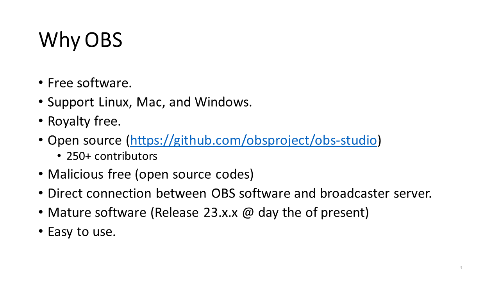
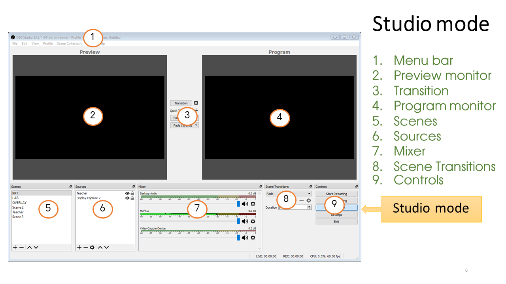
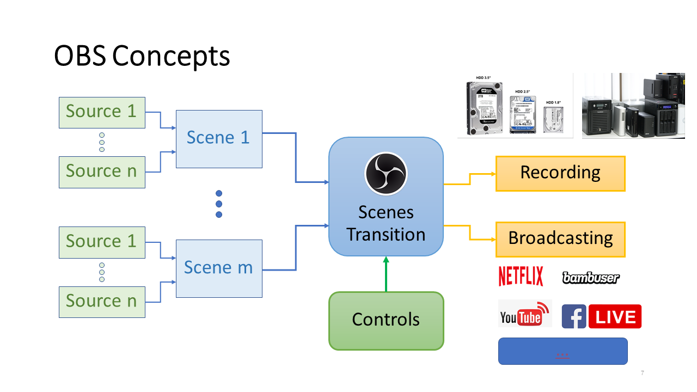

# OBS Training

### OBS: Open Broadcaster Software
Open Broadcaster Software (OBS) เป็น software สำหรับการตัดต่อ บันทึก และ broadcast วิดีโอ ที่สามารถรับแหล่งต้นฉบับได้หลากหลาย ทั้งภาพ เสียง ข้อความ ตัวอักษร วิดีโอ จอภาพคอมพิวเตอร์ เกมส์ ฯลฯ สัญญาณที่ได้จาก OBS นั้นสามารถบันทึกลงในไฟล์ Video ในรูปแบบและอัตราเร็วต่างๆ รวมทั้งสามารถทำ Live streaming ผ่าน server ต่างๆ ได้ด้วย

สามารถดาวน์โหลดซอฟต์แวร์ OBS ได้จาก https://obsproject.com/download 

ซึ่ง OBS นั้นรองรับทั้ง Windows , Mac และ Linux

### ทำไมเลือกใช้ OBS

- OBS เป็น Free software สามารถดาวน์โหลดมาใช้ได้ฟรี ไม่ต้องเสียค่าใช้จ่าย
- OBS รองรับระบบปฏิบัติการที่หลากหลาย ทำงานได้ทั้งบน Linux, Mac, และ Windows
- OBS ไม่มีค่าใช้จ่ายผูกพัน รวมถึง plugin  ต่างๆ ด้วย
- OBS เป็น Open source มี source code อยู่บน gituhb (https://github.com/obsproject/obs-studio) จัดเป็นซอฟต์แวร์ขนาดกลางๆ มีผู้พัฒนาประมาณ 250 คน
- OBS มีการทำงานที่ไว้ใจเรื่องความปลอดภัยได้ เนื่องจากเป็น open source ถ้าสงสัยสามารถดู source code ได้  
- ในการ broadcast นั้น OBS เชื่อมต่อโดยตรงกับ broadcaster server ทำให้ไม่ต้องกังวลว่าจะเกิดความล่าช้าเนื่องจาก server 
- OBS เป็น software ที่อายุมากแล้ว สามารถมั่นใจได้ในสเถียรภาพ (ปัจจุบันนี้เป็น Release 23.x.x )
- OBS ใช้งานง่าย

### หน้าต่าง Open Broadcaster Software interface  ใน Classic mode

### หน้าต่าง Open Broadcaster Software interface  ใน Studio mode

### แนวคิดของ Open Broadcaster Software 

### แนวคิดของ source และ scence 

### แนวคิดของ Scene และ Transition concept 

### Source สำหรับ OBS 

ดูรายละเอียดเพิ่มเติมได้ที่ [แหล่งอินพุตสำหรับประกอบฉาก](./OBS-Source.md)

